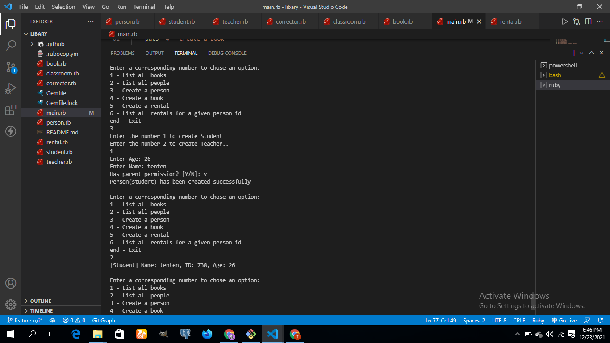

# Project Name
school libary and users

## Built With

- Ruby
 
 ## screen shot
 

## Getting Started

clone the repo or download from https://github.com/tufoinnkuo10/school-libary
## Run the application
- ruby main.rb

## Authors

👤 **TUFOIN NKUO**

- GitHub: [@githubhandle](https://github.com/tufoinnkuo10)
- LinkedIn: [LinkedIn](https://www.linkedin.com/in/tufoin-nkuo/)

## 🤝 Contributing

Contributions, issues, and feature requests are welcome!

Feel free to check the [issues page](../../issues).

## Show your support

Give a ⭐️ if you like this project!

## Acknowledgments

- A special thanks to Microverse for inspiring this project. We are indebted to you all at Microverse
- A special thanks goes to all our peers at Microverse for being there for us.

## 📝 License

This project is [MIT](./MIT.md) licensed.